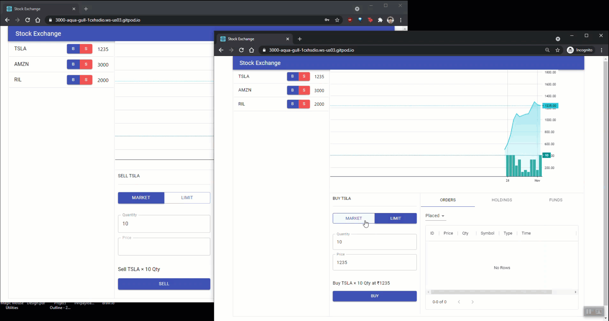

[](https://gitpod.io/#https://github.com/jovinjijo/se)

# Stock Exchange



This is a very simplified implementation of how a stock exchange works. I have no financial background, so I'm open to suggestions on logic used, variable/class names. Feel free to point out any mistakes.

I started out just to try out a TypeScript project and implemented the core logic which is now contained in the @se/core package (yes, this is a monorepo).

### @se/core

@se/core has the logic for order matching, placing orders, orders getting confirmed, keping track of orders of users, orderbook of a symbol and so on.

> Check the [tests folder](packages/core/tests/Orders.test.ts) for usage instructions.

### @se/api

@se/api uses the core library and provides the API which is used by the @se/ui for fetching data. This is build on Express.js and Socket.io.

> Check the [docs folder](packages/api/docs/se_api.postman_collection.json) for the postman collection.

### @se/ui

This is created on React with [Socket.io](https://socket.io/) for sockets, [Material-UI](https://material-ui.com/) for UI components and [Lightweight Charts](https://www.tradingview.com/lightweight-charts/) by TradingView for charting.

> Check the GitPod link for a working demo.

## What's in Scope

- Order matching
- Order placing
- Tracking users' orders, holdings and funds
- Charting prices

## What's not in Scope

- Clearing house?
  > This list is incomplete.

## Repository highlights

- Monorepo (using lerna with yarn; couldn't get it working with yarn workspaces because of a dependency issue; VS Code was not liking yarn2)
- Precommit hooks (husky -> lint-staged, commitlint)
- [Conventional Commits](https://www.conventionalcommits.org/)
- Extensive testing(unit tests, code coverage ^80%)

## Get Started

```
yarn install
yarn run build-watch
yarn start
```

> Open [this](packages/api/docs/se_api.postman_collection.json) in [Postman](https://www.postman.com/) for APIs

## To-do

- Persistence
- Different types of orders (Limit and Market are supported as of now; support for Stop loss, Cover Orders, Bracket Orders)
- Cancelling orders
- Roles (Traders, Admins)
- Leverage
- Trading hours
- Pre-market trading
- Automatic square-off
- Tick Size
- Circuit Breakers
